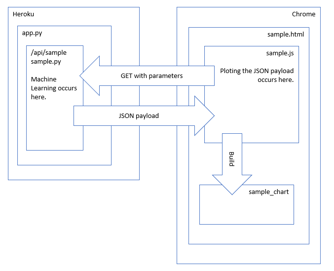

# Sample

## Purpose
The sample application is to be used as a template for displaying machine learning results on a webpage.

## Process
Three modules need to be coded:
* A python program like sample.py that executes machine learning and responds like an API.
* A HTML page like sample.html that hosts the javascript module and the plot.
* A javascript program that makes the GET call to the API and plots the JSON payload.

One module needs to be modified.
* Add the entry for the new HTML module to the toc.html module.

### API Steps
1.  Pull the current repository.
2.  Copy, rename, and modify sample.py to host data engineering and machine learning.
3.  Modify app.py to add the end point to host your python program.
4.  Test locally with Postman.
5.  Push to the repository.
6.  Monitor Heroku dashboard for the application rebuild.
7.  Examine the log file from the Heroku dashboard for error messages.
8.  Test on the Internet with Postman.
9.  Monitor the log from the Heroku dashboard for error messages and print output.

### Visualization Steps
1.  Pull the current repository.
2.  Copy, rename, and modify sample.html to host the javascript and plot.
3.  Copy, rename, and modify sample.js to make GET calls and plot the returning JSON payload.
4.  Modify toc.html to call your html module.
5.  Test locally with Chrome.
6.  Push to the repository.
7.  Monitor Heroku dashboard for the application rebuild.
8.  Examine the log file from the Heroku dashboard for error messages and print output.
9.  Test on the Internet with Chrome.
10.  Monitor the log from the Heroku dashboard for error messages and print output.
